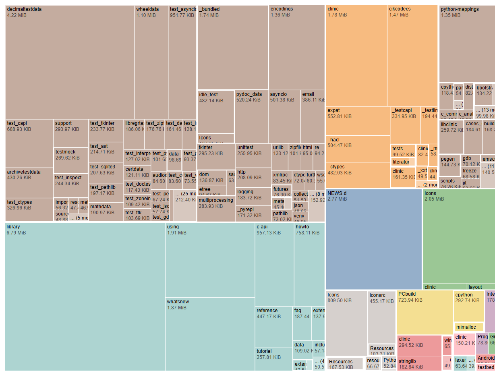

du-treemap
==========

Visualize output from a `du` output.



Getting started
---------------


### Compile

``` bash
npm install
npm run build
```

Open `dist/index.html`


### Run `du`

``` bash
du --apparent-size -b > <PROJECT_HOME>/data/du-output.txt
```

### Inline build

To emit a single self contained `index.html` launch

``` bash
INLINE_BUILD=true npm run build
```
