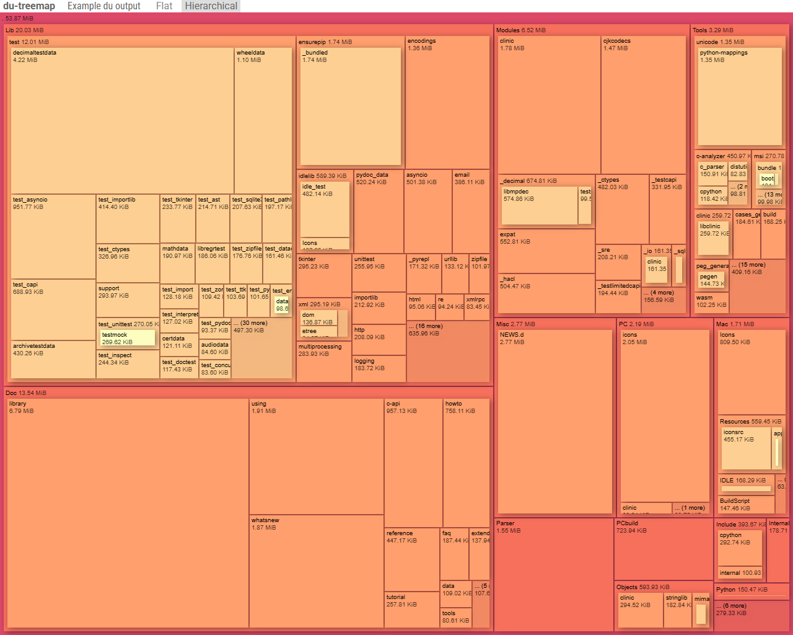
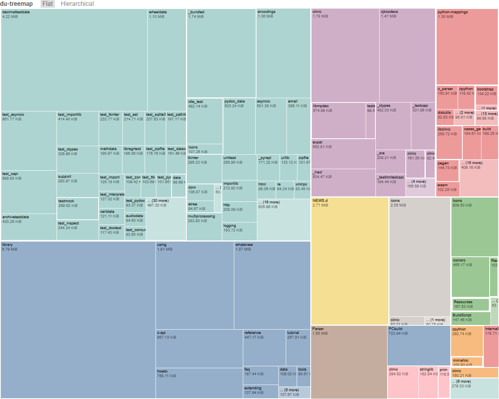

du-treemap
==========

Visualize output from a `du` output.






Getting started
---------------


### Build

``` bash
npm install
npm run build
```

Open `dist/index.html`


Visualize custom `du` output
----------------------------

### Run `du`

Make sure that output ends with `.txt`.

``` bash
du --apparent-size -b > <PATH_TO_DU_OUTPUT_TXT>
```

### Build

``` bash
DATA_FILE=<PATH_TO_DU_OUTPUT_TXT> npm run build
```


Inline build
------------

To emit a single self contained `index.html` launch

``` bash
INLINE_BUILD=true npm run build
```

Inline build can also use custom data:

``` bash
DATA_FILE=<PATH_TO_DU_OUTPUT_TXT> INLINE_BUILD=true npm run build
```


Update screenshots
------------------

Cypress can generate screenshots linked in `README.md`:

``` bash
npm run INLINE_BUILD
npx cypress run --browser chrome --headless
cp cypress_screenshots/screenshot.cy.js/screenshot-1.png doc/
cp cypress_screenshots/screenshot.cy.js/screenshot-2.png doc/
```
